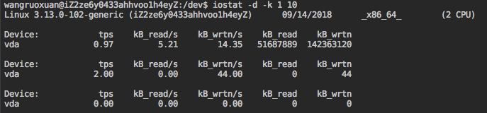
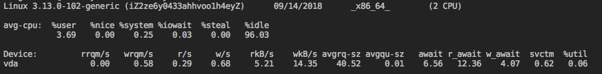

# linux监控

## `dstat`

>  监控linux机器上面CPU，磁盘，网络的基本情况

nload同样无需root权限可以查看网络IO

## iostat 

> 监控linux机器上面的io状态

+ `iostat -d -k 1 10` :参数 -d 表示，显示设备（磁盘）使用状态；-k某些使用block为单位的列强制使用Kilobytes为单位；1 10表示，数据显示每隔1秒刷新一次，共显示10次。

- tps：该设备每秒的传输次数（Indicate the number of transfers per second that were issued to the device.）。“一次传输”意思是“一次I/O请求”。多个逻辑请求可能会被合并为“一次I/O请求”。“一次传输”请求的大小是未知的。

- kB_read/s：每秒从设备（drive expressed）读取的数据量；kB_wrtn/s：每秒向设备（drive expressed）写入的数据量；kB_read：读取的总数据量；kB_wrtn：写入的总数量数据量；这些单位都为Kilobytes。

- `iostat -x`获取更多详细的信息

  

  - await(平均请求响应时间)：每一个IO请求的处理的平均时间（单位是毫秒）。这里可以理解为IO的响应时间，一般地系统IO响应时间应该低于5ms，如果大于10ms就比较大了。
  - %util(磁盘利用率)：在统计时间内所有处理IO时间，除以总共统计时间。例如，如果统计间隔1秒，该设备有0.8秒在处理IO，而0.2秒闲置，那么该设备的%util = 0.8/1 = 80%，所以该参数暗示了设备的繁忙程度。一般地，如果该参数是100%表示设备已经接近满负荷运行了（当然如果是多磁盘，即使%util是100%，因为磁盘的并发能力，所以磁盘使用未必就到了瓶颈）。

- 指标: await<5ms

- 常见用法

  + iostat -d -k 1 10 #查看TPS和吞吐量信息

  - iostat -d -x -k 1 10 #查看设备使用率（%util）、响应时间（await）
  - iostat -c 1 10 #查看cpu状态

## Aliyun

> aliyun 控制台提供了可视化的监控界面, 包括CPU，网络，磁盘，内存等等

aliyun的磁盘使用vda(Virtual Delivery Agent), 在`/dev/`目录下

## free

> 显示内存的使用情况

+ total：内存总数

+ used：已经使用的内存数

+ free：空闲的内存数

+ shared：当前已经废弃不用

+ buffers Buffer：缓存内存数

+ cached Page：缓存内存数

+ Swap: 交换空间

+ (-buffers/cache) used内存数：第一部分Mem行中的 used – buffers – cached

+ (+buffers/cache) free内存数: 第一部分Mem行中的 free + buffers + cached

`-buffers/cache`反映的是被程序实实在在吃掉的内存，而`+buffers/cache`反映的是可以挪用的内存总数。

Buffer Cache和Page Cache。前者针对磁盘块的读写，后者针对文件inode的读写。这些Cache有效缩短了 I/O系统调用(比如read,write,getdents)的时间。 磁盘的操作有逻辑级（文件系统）和物理级（磁盘块），这两种Cache就是分别缓存逻辑和物理级数据的。

linux,只要不用swap的交换空间,就不用担心自己的内存太少.如果常常swap用很多,可能你就要考虑加物理内存了.这也是linux看内存是否够用的标准. 

少量的使用swap交换空间，不会太大的影响性能，大量使用swap，增加IO的负载，会影响服务器整体性能。

例如： worker 处理大视频或者图片是占用了大量的内存，导致内存不够用，使用了swap交换空间，增加了IO负载，显示IO负载达到了2000+ IOPS，以及IO吞吐量到达了70MB/s

## ps

> ps 显示系统当前状态命令

+ `ps -p <pid> -v `: 显示某个进程的详情信息
  - USER：该 process 属于那个使用者账号的
  - PID ：该 process 的号码
  - %CPU：该 process 使用掉的 CPU 资源百分比
  - %MEM：该 process 所占用的物理内存百分比
  - VSZ ：该 process 使用掉的虚拟内存量 (Kbytes)
  - RSS ：该 process 占用的固定的内存量 (Kbytes)

## 其他

+ `ss` 命令用来显示处于活动状态的socket信息，和netstat类似，但是ss的优势在于可以显示更多更详细的TCP和连接状态的信息，比netstat更快速高效
+ `netstat`: linux中查看网络状态信息
+ `top` 进程情况， top -p pid -v查看具体某个进程详情
+ `ps aux | sort -k4,4nr | head -n 10`查看占用内存前10的进程

## 实例

#### gray log 查日志技巧

+ `BU:nginx AND http_code:499 AND "<url>"` 查询nginx请求的日志

+ 直接传入token，在gray log中查链路
+ `graylog`存储的日志有日期限制，在一定时间之后会清除日志

## Reference

[iostat blog](http://www.ha97.com/4546.html)

[linux 命令行大全](https://wangchujiang.com/linux-command/)